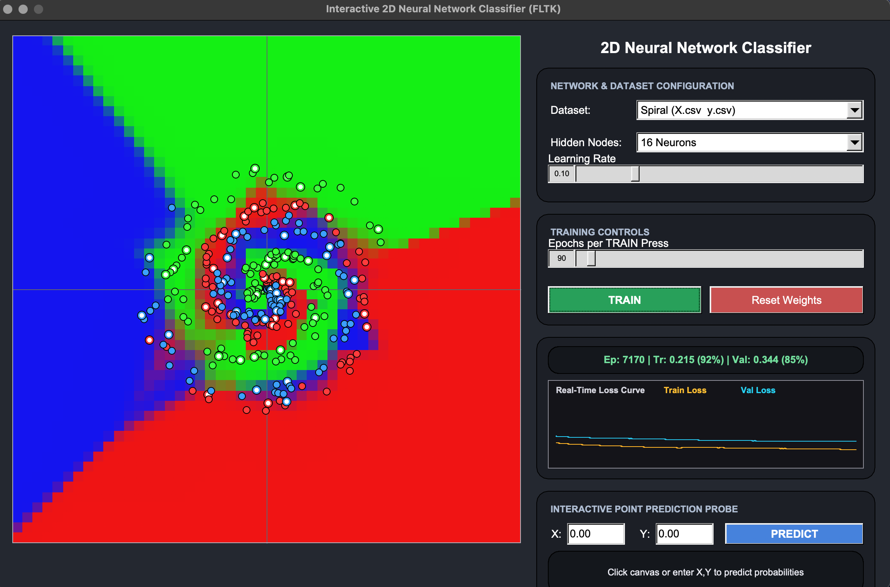

# C++ Neural Network Classifier

A simple neural network classifier built from scratch in C++.

This project shows how a basic neural network works internally without using a machine learning library. The neural network is written in C++ and has a graphical interface made using FLTK.

The program can train a neural network on different 2D datasets, show the decision boundary, display training loss, and predict the class of a new point.

----

## Program Preview



--

## Features

- Neural network implemented from scratch in C++
- Uses C++17
- Graphical user interface using FLTK
- Supports multiple 2D datasets
- Training using backpropagation
- ReLU activation function
- Softmax output layer
- Categorical Cross-Entropy loss
- Training and validation loss visualization
- Decision boundary visualization
- Interactive point prediction
- Configurable learning rate
- Configurable number of epochs
- Configurable number of hidden neurons
- Test mode for checking training performance
- Dataset generation using Python
- Dataset visualization using Jupyter Notebook

---

## How the Neural Network Works

The neural network used in this project has the following structure:

Input
↓
Dense Layer
↓
ReLU
↓
Dense Layer
↓
ReLU
↓
Dense Layer
↓
Softmax
↓
Output

The default network contains:

- 2 input features
- 16 neurons in the first hidden layer
- 16 neurons in the second hidden layer
- 3 output neurons

The input contains two values, such as an X and Y coordinate.

The output contains the probabilities for the three possible classes.

For example:

Class 0: 0.05
Class 1: 0.90
Class 2: 0.05

In this case, the model predicts Class 1.

---

## Main Components

### 1. Matrix

A custom matrix class is used for storing and working with numerical data.

It supports operations needed by the neural network, such as:

- Matrix multiplication
- Addition
- Subtraction
- Transpose
- Element-wise operations
- Random initialization

This allows the neural network to perform its calculations without using a machine learning library.

---

### 2. Dense Layer

The Dense layer performs the main calculation of a neural network layer.

The basic calculation is:

output = input × weights + bias

The Dense layer also calculates gradients during backpropagation and updates its weights and biases.

---

### 3. ReLU Activation

ReLU is used in the hidden layers.

The function is:

ReLU(x) = max(0, x)

This means:

- If x is greater than 0, the output is x.
- If x is less than or equal to 0, the output is 0.

ReLU helps the neural network learn non-linear patterns.

---

### 4. Softmax

Softmax is used in the final layer.

It converts the final outputs of the neural network into probabilities.

The probabilities add up to 1.

For example:

Class 0 = 0.10
Class 1 = 0.70
Class 2 = 0.20

The predicted class is Class 1 because it has the highest probability.

---

### 5. Categorical Cross-Entropy

Categorical Cross-Entropy is used as the loss function.

It measures how different the predicted probabilities are from the correct class.

A lower loss generally means that the model is learning to make better predictions.

---

### 6. Backpropagation

Backpropagation is used to train the neural network.

The general process is:

1. Input data is given to the network.
2. The network produces an output.
3. The output is compared with the correct answer.
4. The loss is calculated.
5. Gradients are calculated using backpropagation.
6. Weights and biases are updated.
7. The process is repeated for many epochs.

---

## Datasets

The project works with simple 2D datasets.

The available datasets include:

### Spiral

The spiral dataset contains points arranged in spiral patterns.

It is useful for showing how a neural network can learn a non-linear decision boundary.

### Generated Spiral

A spiral dataset can also be generated by the program.

### Concentric Circles

This dataset contains points arranged in circular patterns.

The classes form different regions around the center.

### XOR Quadrants

This dataset represents an XOR-like classification problem.

It is useful for showing why a non-linear neural network is needed for some classification problems.

---

## Graphical User Interface

The program provides a graphical interface using FLTK.

The interface allows the user to:

- Select a dataset
- Set the number of hidden neurons
- Set the learning rate
- Set the number of training epochs
- Start training
- Reset the network
- View the decision boundary
- View training and validation loss
- Enter a point for prediction
- View the predicted class and class probabilities

---

## Project Structure

```text
cppNeuralNetwork/
│
├── src/
│   └── main.cpp
│
├── data/
│   ├── X.csv
│   └── y.csv
│
├── scripts/
│   ├── detagen.py
│   └── dataplot.ipynb
│
├── Makefile
├── README.md
└── .gitignore